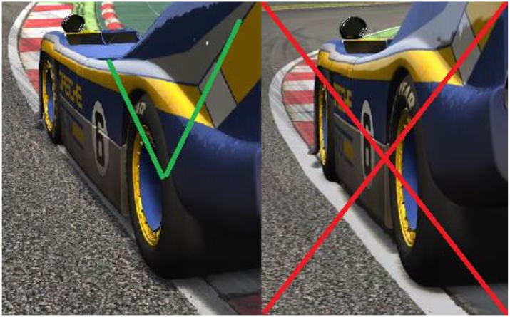

## 1. Lyhyesti

1. Kunnioita toista kilpailijaa.
2. Pidä kaksi rengasta radalla.
3. Ajolinjan peittäminen on sallittua ennen jarrutusta, mutta toisen auton päälle ei saa leikata.
4. Linjan vaihto jarrutuksessa on kielletty.
5. Toista kilpailijaa ei saa ajattaa ulos radalta.
6. Protestit toimitetaan kilpailun jälkeen tiedotetulla lomakkeella.

---

## 2. Yleistä

Simulaattorikilpailu on kilpailemista siinä missä mikä tahansa urheilumuoto. Tavoitteena on suorittaa kilpailumatka nopeimmin tai edetä annetussa kilpailuajassa mahdollisimman pitkä matka. Kilpailun tavoite voi tarkentua kilpailukutsussa.

Näillä säännöillä takaamme kaikille yhtäläiset mahdollisuudet ja korostamme reilua kilvanajoa.

Ajotavassa ja tuomariston tulkinnassa noudatetaan pitkälti samoja periaatteita kuin oikeassa kilpa-autoilussa. Kehotamme kuitenkin lukemaan nämä säännöt huolellisesti.

Toisin kuin oikeassa autourheilussa, painopiste ei ole turvallisuusriskeissä vaan kilpailijoiden välisessä reilussa ja ennakoivassa ajotavassa. Tästä syystä rangaistukset kohdistuvat erityisesti niiden laiminlyöntiin.

Yksittäisen kilpailun säännöt koostuvat kolmesta dokumentista:

1. Yleiset säännöt
2. Kilpailijaohje (valinnainen)
3. Rataesittely (valinnainen)

Mikäli kilpailussa on tuomaristo, voidaan sääntöjä tarkentaa painavasta syystä viimeistään ennen kilpailulähtöä.
Seuraa simulaattorin chattia tai sarjan tiedotusta odotusaikoina.

---

## 3. Ajoetiketti

Radalla ajaessa on huomioitava myös muut kuljettajat.

Toisen tahallinen törkeä estäminen tai vaaratilanteen aiheuttaminen ei ole sallittua.

Ohitustilanteissa sijoituksen puolustaminen on sallittua tavallisin ratasäännöin (ks. kohta “ohittaminen”).

---

## 4. Rata ja sen osat

Kilpailijan on tunnistettava seuraavat radan osat:

1. Rata-alue
2. Varikko-alue

- Vähintään kaksi rengasta on oltava rata-alueella
- Sisämutkan leikkaaminen on kielletty
- Ulostulossa voidaan sallia leveämpi linja kilpailukohtaisesti

Havaintokuvia ratarajojen ylityksestä.

Mahdolliset ratarajojen poikkeukset ilmoitetaan kilpailijaohjeessa.

---

## 5. Ohittaminen

Kilpailun aikana kuljettaja saa käyttää koko radan leveyttä, ohitustilannetta lukuunottamatta.

Edellä ajavan kuljettajan tulee sallia ohitus sääntöjen puitteissa, mutta hänellä on myös oikeus puolustaa ajolinjaansa.

Kuljettajan katsotaan olevan rinnalla kun ohittavan auton eturenkaan akseli on saavuttanut ohitettavan auton takarenkaan akselin. Tällöin ohitettavan kuljettajan on pidettävä ajolinja sellaisena että ohittava auto mahtuu radalle. Edellä ajava auto saa kuitenkin valita ajolinjansa edellisen rajoituksen puitteissa.

Mahdollisen törmäyksen syyllinen päätetään jätetyn tilan perusteella.

Kiellettyä:

- reaktiiviset suunnanmuutokset (mutkittelu)
- toisen kilpailijan estäminen / ulosajattaminen
- Linjan vaihtaminen jarrutuksen aikana
- kiilaaminen / pommitus
- muut sääntöjenvastaiset liikkeet

Kilpailijat saavat käyttää vain kilparataa ohituksen aikana.
Ajolinjan muutos ei saa olla äkillinen tai vaaratilanteen aiheuttava.
Ajopaikan puolustaminen on sallittua autojen rinnakkaisuus huomioiden.
Ajolinjan peittäminen/valinta on tehtävä ennen jarrutusta.

---

## 6. Lippusäännöt

### Sininen lippu

Takaa tulevan ohitusta on helpotettava siten, ettei hänen nopeutensa kärsi.

### Keltainen lippu

Valmistaudu väistämään tai pysähtymään.  
Ohittaminen on sallittua, mutta törmäys- tai muu vaaratilanne johtaa korotettuun rangaistukseen.

### Musta lippu

Kuljettaja on poistettu kilpailusta.  
Hänen tulee väistää muita kilpailijoita.

---

## 7. Herrasmiessääntö

Herrasmiessäännöllä tarkoitetaan oma-aloitteista reilua ja ennakoivaa ajamista sekä virheiden hyvittämistä.
Kuljettajilta odotetaan:

- ennakoivaa ajamista
- reilua toimintaa ja muiden kuljettajien kunnioittamista
- virheiden hyvittämistä ja anteeksipyyntöä heti virheen tai kilpailun jälkeen

Sijoituksen palauttaminen voidaan huomioida mahdollisen rangaistuksen lieventävänä tekijänä.
Herrasmiessääntö on FiSUn tärkeimpiä sääntöjä. Kiistat jäävät radalle ja mahdolliset hampaankoloon jäävät asiat selvitetään viimeistään ennen seuraavaa kisaa. Tuomaristo auttaa kilpailun jälkeen epäselvissä tilanteissa.

---

## 8. Protestit

Protesti tulee jättää kilpailua seuraavana päivänä klo 20:00 mennessä tai muuna erikseen ilmoitettavana ajankohtana.

Protesti jätetään kilpailukohtaisen linkin kautta verkkosovelluksessa.

Rangaistukset ilmoitetaan samassa kanavassa kuin kilpailun ohjeet.

Protestin vastalause tai oikaisupyyntö käsitellään kertaluonteisena vetoomuksena.

---

## 9. Rangaistuskäytäntö

## 9.1 Yleistä

Tässä luvussa määritellään sarjan rangaistuskäytäntö, jonka tavoitteena on edistää reilua ja turvallista kilpailua sekä puuttua tehokkaasti toistuviin tai vakaviin rikkeisiin. Rangaistusjärjestelmä perustuu kumulatiivisiin rangaistuspisteisiin (RP) ja niiden vaikutukseen sarjapisteisiin (SP).

Järjestelmä on suunniteltu siten, että yksittäisestä lievästä virheestä ei rangaista välittömästi sarjapistein, mutta toistuvat rikkeet tai yksittäiset vakavat teot johtavat sarjapistemenetyksiin. Kuljettajan parantaessa käytöstään laskennalliset rangaistuspisteet pienenevät, mikä keventää tulevia seuraamusriskejä.

Rikkomusten käsittelystä vastaa vähintään kolmihenkinen riippumaton tuomaristo. Tilanteissa, joissa rikkomus tai olosuhteet eivät suoraan kuulu sääntökirjan piiriin, tuomaristolla on harkintavalta soveltaa sääntöjä tarkoituksenmukaisesti.

---

## 9.2 Rangaistuspistejärjestelmä (RP)

### 9.2.1 Rangaistuspisteiden kertyminen

Tuomaristo voi määrätä kuljettajalle rangaistuspisteitä kussakin kilpailussa todettujen rikkomusten perusteella.
Rangaistuspisteet ovat kumulatiivisia koko kauden ajan, mutta niihin sovelletaan laskennallista vähennystä (ks. kohta 9.2.3).

---

### 9.2.2 Sarjapistemenetyksen kynnykset

Rangaistuspisteet vaikuttavat sarjapisteisiin seuraavan asteikon mukaisesti:

| Laskennalliset RP | Sarjapistemenetys                                           |
|-------------------|-------------------------------------------------------------|
| Alle 10 RP        | Ei menetystä                                                |
| 10–19 RP          | 10–15 sarjapistettä                                         |
| 20 -24 RP         | 30 sarjapistettä                                            |
| 25 RP tai enemmän | 30 sarjapistettä ja kilpailukielto seuraavaan osakilpailuun |

Sarjapistemenetys suhteutetaan sarjakohtaisesti kilpailujen määrään ja maksimipisteisiin. Tuomaristo vahvistaa käytettävän suhteutuksen ennen kauden alkua.

Sarjapistemenetys toteutetaan sen kilpailun jälkeen, jonka seurauksena kynnys ylittyy.

---

### 9.2.3 Laskennallinen vähennys rangaistuspisteisiin

Järjestelmä on suunniteltu siten, että yksittäinen virhe ei johda välittömästi sarjapistemenetykseen, mutta toistuvat rikkomukset johtavat seuraamuksiin.

Kun kuljettajalle määrätään sarjapistemenetys, vähennetään laskennassa käytettäviä rangaistuspisteitä samanaikaisesti 5 pisteellä.

- Rankasta tai toistuvasta virheestä rangaistaan sarjapisteiden menetyksellä.
- Yksittäinen lievä virhe ei välttämättä johda sarjapistemenetykseen.  
- Kuljettajan parantaessa käytöstään laskennalliset RP pienenevät, mikä pienentää tulevan sakotuksen riskiä.  
- Toistuvat pienetkin rikkeet johtavat kuitenkin lopulta sarjapistemenetyksiin, mikäli rangaistuspisteet kumuloituvat riittävästi.

Laskennallinen vähennys tehdään ainoastaan sarjapistemenetyksen yhteydessä – ei automaattisesti ajan kulumisen perusteella, ellei erikseen toisin päätetä.

---

## 9.3 Rangaistukset rikotun kuljettajan hyväksi

Jos tuomaristo toteaa, että kuljettaja on kärsinyt merkittävää haittaa toisen kuljettajan rikkomuksen seurauksena, huomioidaan tämä rangaistuksen mitoituksessa. Tuomaristolla on käytössään seuraavat keinot:

### Sarjapistemenetyksen korottaminen 
rikkomuksen vakavuus ja sen vaikutus rikotun kuljettajan kilpailuasemaan otetaan huomioon kokonaisharkinnassa
### Aikasanktio tai sijoituksen menetys
mikäli kuljettaja on rikkonut sääntöjä tahallisesti estääkseen kanssakilpailijaa saavuttamasta tarvittavaa sijoitusta tietyssä kilpailussa, voidaan rikkovaa kuljettajaa rangaista myös aikasakolla tai kisasijoituksen menettämisellä
Kaikki toimenpiteet perustuvat tuomariston kokonaisharkintaan.

Korotettua rangaistusta ei sovelleta tilanteissa, joissa rikottu kuljettaja on myötävaikuttanut onnettomuuteen.

---

## 9.4 Rikkomusten luokittelu ja pistetaulukko

Rikkomukset jaetaan kahteen pääluokkaan vakavuuden mukaan. Luokittelu on suuntaa antava, ja sama rikkomus voidaan arvioida eri vakavuusluokkaan tilanteesta riippuen, joiden puitteissa tuomaristo harkitsee jokaisen tapauksen yksilöllisesti.

Tuomariston jäsenet päättävät jakamistaan pisteistä itsenäisesti, lopullisen pisteiden ollessa annettujen rangaistuspisteiden keskiarvo alaspäin pyöristettynä.
Pisteiden jaossa otetaan huomioon kilpailun ajankohta. Ensimmäisen kierroksen rikkeistä rangaistuspisteet annetaan pääsääntöisesti kaksinkertaisena.

---

### 9.4.1 Varomaton ajo (1–5 rangaistuspistettä)

Varomattomaksi ajoksi katsotaan tilanteet, joissa kuljettaja on toiminut huolimattomasti tai arvioinut tilanteen väärin ilman selkeää tahallisen toiminnan merkkejä.

| Rikkomus                                                | RP-haarukka (ohjeellinen) |
|---------------------------------------------------------|---------------------------|
| Liian viime hetkellä ohittamaan lähteminen              | 1–3                       |
| Peräänajo jarrutuksessa                                 | 2–4                       |
| Vaarallinen radalle paluu tai tulo                      | 2–4                       |
| Liian vähäisen tilan jättäminen vastustajalle           | 2–4                       |
| Linjojen risteäminen vaarallisesti                      | 2–4                       |
| Ohittavan kilpailijan päälle kääntyminen (reaktiivinen) | 3–5                       |

---

### 9.4.2 Aggressiivinen ajo (6–10 rangaistuspistettä)

Aggressiiviseksi ajoksi katsotaan tilanteet, joissa kuljettaja on toiminut harkitsemattomasti tai selkeästi muiden kustannuksella. Tähän luokkaan kuuluvat myös toistuvat varomattoman ajon rikkeet.

| Rikkomus                                              | RP-haarukka (ohjeellinen) |
|-------------------------------------------------------|---------------------------|
| Syöksyminen tilaan, jota ei enää ole (pommittaminen)  | 6–8                       |
| Kilpailijan tarkoituksellinen ulosajattaminen         | 7–10                      |
| Estäminen (esim. sääntöjen vastainen mutkittelu)      | 6–8                       |
| Linjan vaihtaminen jarruttaessa                       | 6–8                       |
| Keltaisten lippujen huomiotta jättäminen / never lift | 6–9                       |
| Ratarajojen ulkopuolelta ohittaminen                  | 6–8                       |

Tuomaristo voi korottaa rangaistuspisteitä RP-haarukoiden ulkopuolelle, mikäli rikkomus on selkeästi tahallinen, toistuu kauden aikana tai aiheuttaa poikkeuksellisen vakavan onnettomuuden. Vastaavasti pisteitä voidaan alentaa, jos asiaan liittyy lieventäviä seikkoja kuten sijoituksen takaisinanto.

---

## 9.5 Protestit ja päätösprosessi

### 9.5.1 Protestin jättäminen

Protestit jätetään protestit.simu.fi-järjestelmän kautta. Protesti tulee jättää vuorokauden kuluessa kilpailun päättymisestä tai sarjan tiedotuksen mukaiseen hetkeen mennessä. Myöhässä jätetyt protestit käsitellään harkinnan mukaan.

Protesti voidaan jättää seuraavissa tilanteissa:

- Epäily toisen kuljettajan rikkomuksesta
- Tuomariston päätöksestä valittaminen (ks. 9.5.3)

---

### 9.5.2 Tutkintaprosessi

Tuomaristo tutkii tapauksen saatavilla olevan materiaalin perusteella (replay tiedosto, onboard-video, lähetys, telemetria).  
Päätös pyritään julkistamaan 24 tunnin kuluessa protestin jättämisestä.  
Molempia osapuolia kuullaan tarvittaessa ennen päätöksen julkistamista.

Rangaistavalla kuljettajalla on oikeus vastaprotestiin, mikäli hän esittää uutta olennaista tietoa, jota tuomaristo ei ole voinut huomioida alkuperäisessä käsittelyssä.

---

### 9.5.3 Muutoksenhaku

Päätöksestä voi valittaa sarjan johdolle 24 tunnin kuluessa päätöksen julkistamisesta protestit.simu.fi-järjestelmän kautta.  
Muutoksenhaku ei lykkää rangaistuksen voimaantuloa, ellei sarjan johto toisin päätä.  
Lopullinen päätös on sarjan johdon harkinnassa.

---

## 9.6 Käytännön esimerkit

### Esimerkki A – Ensimmäisen kierroksen yhteentörmäys

| Vaihe                           | Kuvaus                                                                                                                           |
|---------------------------------|----------------------------------------------------------------------------------------------------------------------------------|
| Tapahtuma                       | Kuljettaja aiheuttaa ensimmäisellä kierroksella törmäyksen (2 × 6 RP, ensimmäisen kierroksen rangaistuspisteet kaksinkertaisena) |
| Kertyneet RP                    | 12 RP → ylittää 10 RP:n kynnyksen                                                                                                |
| Seuraamus                       | 10–15 sarjapisteen menetys. Laskennalliset RP vähenevät 5:llä → 7 RP                                                             |
| Seuraava kisa (2 RP virhe)      | Laskennalliset RP: 7 + 2 = 9 RP → ei sarjapiste menetyksiä                                                                       |
| Sitä seuraava kisa (2 RP virhe) | Laskennalliset RP: 9 + 2 = 11 RP → 10–15 sp:n menetys. Laskennalliset RP: 6 RP                                                   |

---

### Esimerkki B – Vakava rikkomus

| Vaihe                       | Kuvaus                                                       |
|-----------------------------|--------------------------------------------------------------|
| Tapahtuma                   | Kuljettaja saa yhdessä kisassa 22 RP vakavista rikkomuksista |
| Seuraamus                   | 30 sarjapisteen menetys. Laskennalliset RP: 22 − 5 = 17 RP   |
| Puhdas kisa                 | Laskennalliset RP pysyvät 17:ssä (ei muutosta)               |
| Viimeinen kisa (2 RP virhe) | Laskennalliset RP: 17 + 2 = 19 RP → 10–15 sp:n menetys       |

---

## 9.7 Yleiset periaatteet ja tuomariston harkintavalta

Rangaistusjärjestelmä on suuntaa antava. Tuomaristolla on oikeus poiketa ohjearvoista tai pistemenetyksistä, mikäli tilanteen erityispiirteet sitä vaativat.

Harkinnan perusteita ovat:

- Tapauksen vakavuus ja seuraukset rikotulle kuljettajalle
- Kuljettajan aiempi käytöshistoria kauden aikana
- Kuljettajan "droppikisa" missä rikkoneella kuljettajalla ei panosta
- Tilanteen olosuhteet (ensimmäinen kierros, märkä rata, safety car / keltaiset liput-tilanne jne.)
- Tahallisen tai harkitsemattoman toiminnan todennäköisyys
- Kuljettajan aktiivinen pyrkimys tilanteen selvittämiseen
- Sijoituksen palauttaminen – välitön ja selkeä palautus voidaan huomioida merkittävänä lieventävänä tekijänä

Kaikkien päätösten on oltava johdonmukaisia, perusteltuja ja julkistettuja.

*Tämä rangaistuskäytäntö on voimassa toistaiseksi ja sitä voidaan päivittää kauden aikana sarjan johdon päätöksellä.
Mahdollisista muutoksista ilmoitetaan kuljettajille vähintään 48 tuntia ennen seuraavaa kilpailua.*

## 10. Varikolle hyppääminen / Teleport to pits sääntö

varikolle saa hypätä harjoituksissa ja aika-ajossa vapaasti ilman seuraamuksia. Ota mahdollisuuksien mukaan kilpailulähetys huomioon ja pysäytä auto radan sivuun ennen teleporttausta.

Kilpailulähdössä varikolle hyppääminen tarkoittaa kilpailun pisteiden menetystä (DNF). Poikkeuksena lähtöruudukosta varikolle siirtyminen tai pelin virhetilanne mitkä käsitellään tapauskohtaisesti.

Kilpailun jatkaminen varikolle hyppäämisen jälkeen ei ole kiellettyä, mutta kuljettajalla on velvollisuus välttää  muiden kuljettajien kilpailuun vaikuttamista. Mahdolliset rikkeet tuomitaan näissä tapauksissa korotettuna.

## 11. Tekniset ongelmat

Kilpailu tai aika-ajo voi päättyä ennenaikaisesti esimerkiksi palvelinongelman vuoksi, jolloin kaikki tai suuri osa kuljettajista ei voi jatkaa kilpailua.
Toimenpiteet keskeytyneen session vuoksi.

| Suoritettu | Toimenpide                                                                                                         |
|------------|--------------------------------------------------------------------------------------------------------------------|
| 75–100 %   | Kilpailu ja aa päätetään, aika-ajosta käytetään viimeistä serverille tallentunutta tilannetta                      |
| 50–75 %    | Kilpailu päätetään, aa uusitaan. Kilpailun pisteet puolitetaan, aika-ajo uusitaan mahdollisesti lyhennettynä       |
| 0–50 %     | Kilpailu ja aa uusitaan mahdollisuuksien mukaan täysimittaisena. Mahdollista ajaa sessio lyhennettynä|

Teknisten ongelmen sattuessa seuraa kilpailun voice- ja teksti-kanavia Discordissa tai pelin sisäisessä chatissä.

## 12. Ilmoittautuminen

Sarjoihin ja kilpailuihin ilmoittaudutaan simracing.fi -sivuston kautta.

---

## 13. Pistejärjestelmä

Sarjojen pistelasku on sarjakohtainen ja ilmoitetaan sarjan tiedoissa.

Tasapisteissä ratkaisee:

- korkeampien sijoitusten määrä
- ensimmäinen korkeampi sijoitus